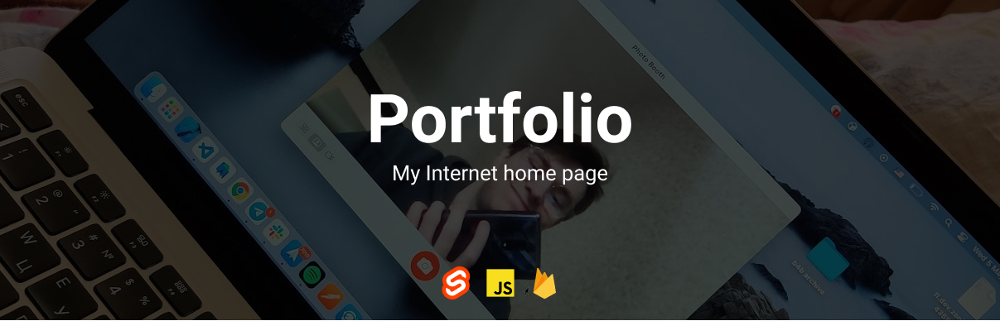
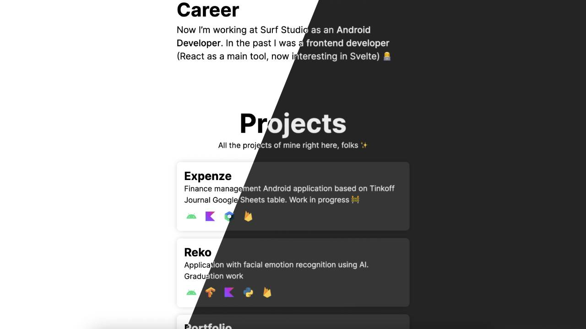

## Portfolio (Deprecated)

There is my simple portfolio page with basic info about me and my projects. This repository is deprecated because I made a blog site instead of simple single page portfolio. Check it out here - [weazyexe/blog](https://github.com/weazyexe/blog)

## Stack

- Svelte 3
- Yarn
- Bootstrap
- Firebase

## Features

- Dark Theme
- Random emojis in footer 🙈
- Analytics
- Loading projects list from Firebase

## Previous versions

You can find previous versions of my portfolio in `v*` branches
